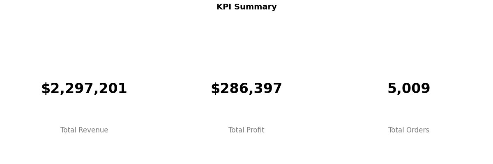
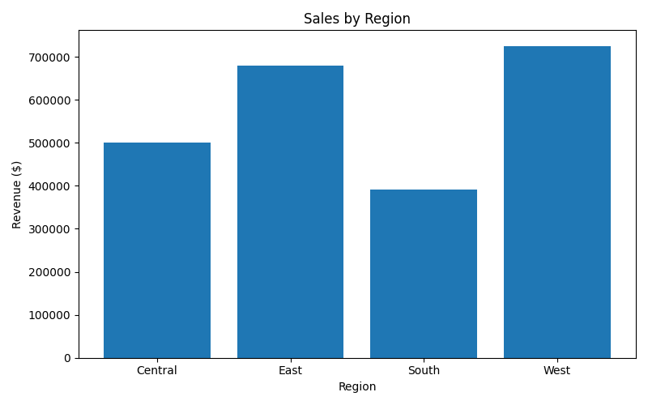
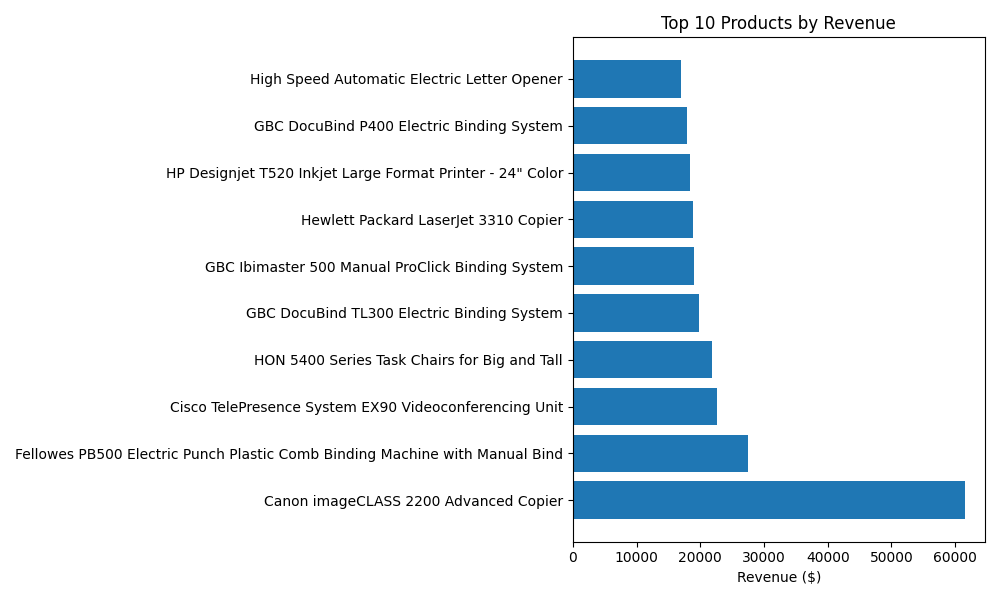
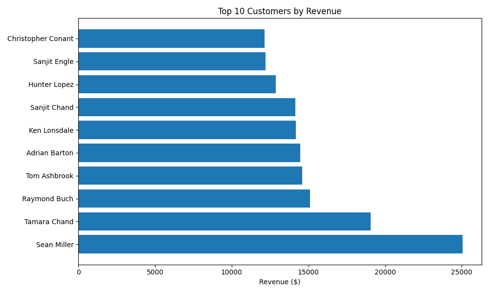
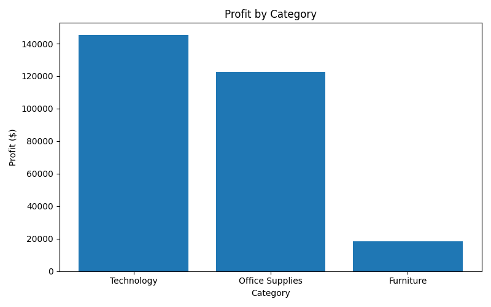
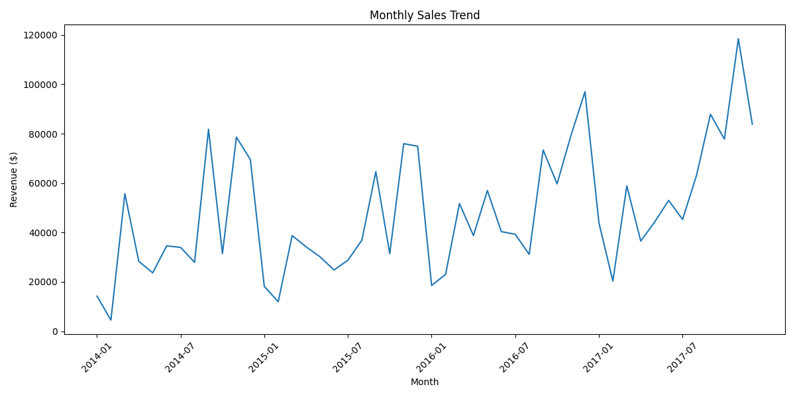
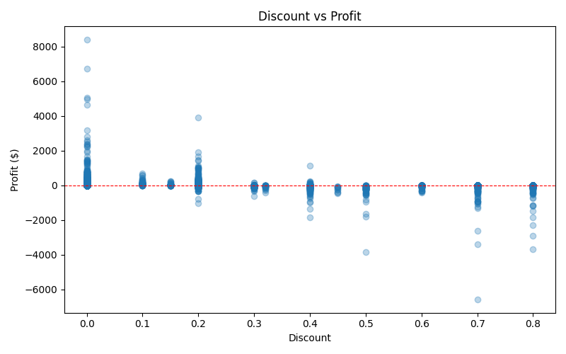
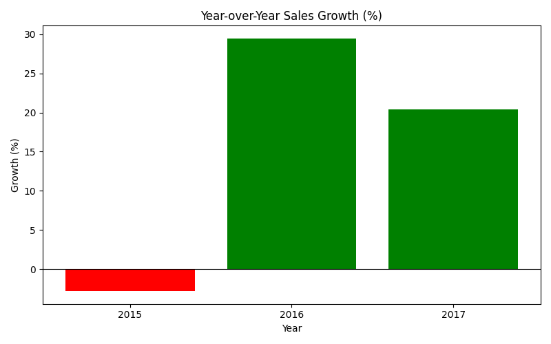

# Superstore Sales Analytics

An end-to-end data analytics project that analyzes the Sample Superstore dataset using Python, SQLite, and Matplotlib — generating actionable business insights and a full PDF report.

---

## Project Structure

```
SalesDataAnalytics/
├── data/
│   └── Sample - Superstore.csv
├── database/
│   └── superstore.db
├── outputs/
│   ├── kpi_summary.png
│   ├── sales_by_region.png
│   ├── top_products.png
│   ├── top_customers.png
│   ├── profit_by_category.png
│   ├── monthly_sales_trend.png
│   ├── discount_vs_profit.png
│   ├── yoy_growth.png
│   └── sales_report.pdf
├── src/
│   ├── load_data.py
│   ├── create_database.py
│   ├── sql_queries.py
│   ├── visualize_data.py
│   └── generate_report.py
├── main.py
├── requirements.txt
└── README.md
```

---

## Tech Stack

- Python 3
- Pandas — data loading and manipulation
- SQLite — structured querying via SQL
- Matplotlib — data visualization
- fpdf2 — PDF report generation

---

## Setup & Installation

1. Clone the repository
   ```bash
   git clone https://github.com/techieguru-oss/SalesDataAnalytics.git
   cd SalesDataAnalytics
   ```

2. Install dependencies
   ```bash
   pip install -r requirements.txt
   ```

3. Run the project
   ```bash
   python main.py
   ```

---

## SQL Queries

| # | Query | Description |
|---|-------|-------------|
| 1 | Sales by Region | Total sales grouped by region |
| 2 | Top Products | Top 10 products by revenue |
| 3 | Top Customers | Top 10 customers by revenue |
| 4 | Sales by Category | Revenue grouped by product category |
| 5 | Profit by Category | Total profit grouped by category |
| 6 | Monthly Sales Trend | Revenue aggregated month-over-month |
| 7 | Discount vs Profit | Raw discount and profit values for correlation analysis |
| 8 | Year-over-Year Growth | Annual sales with YoY growth percentage |
| 9 | KPI Summary | Total revenue, total profit, and total orders |

---

## Charts Generated

### KPI Summary
Total Revenue, Total Profit, Total Orders at a glance



### Sales by Region
Bar chart comparing regional performance



### Top 10 Products
Horizontal bar chart of highest revenue products



### Top 10 Customers
Horizontal bar chart of highest revenue customers



### Profit by Category
Bar chart of profit across categories



### Monthly Sales Trend
Line chart of revenue over time



### Discount vs Profit
Scatter plot revealing the impact of discounts on profit



### Year-over-Year Growth
Bar chart with green/red indicators for growth trends



---

## Output

All charts are saved as `.png` files in the `outputs/` folder. A consolidated PDF report (`sales_report.pdf`) is also generated containing all charts.

---

## Key Insights

- Higher discounts correlate with negative profit — over-discounting is a key business risk
- Technology category drives the highest revenue and profit
- Sales show consistent year-over-year growth with seasonal spikes toward year-end

---

## Dataset

[Sample Superstore Dataset](https://www.kaggle.com/datasets/vivek468/superstore-dataset-final) — a popular retail dataset containing orders, customers, products, sales, and profit data across US regions.

---

## Author

Akansha Singh

Computer Science Student